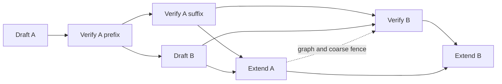

# Same-GPU speculative decoding overlap experiment

This experiment targets throughput with multiple independent requests. Both
models use the same TP=2 GPU allocation. It does not put the draft on a dedicated
GPU. `--speculative-microbatch-mode off` preserves the existing path; `serial`
and `overlap` are coarse split-batch controls. `fine_serial` and `fine_overlap`
use target continuations and independent draft steps; full CUDA graphs use ordered
topological cuts of the captured target DAG. See [fine-grained results](FINE_REPORT.md).

## Dependencies

The current EAGLE3 cycle is `draft -> verify + accept -> draft extend -> draft`.
`EagleDraftWorker._draft_extend_for_decode` consumes target auxiliary hidden
states, accept lengths, and the bonus token. This is a true same-request
dependency. Separate streams do not remove it. PEARL's independent draft/target
processes, pre/post verification and rollback change the algorithmic schedule;
its standalone-model implementation cannot simply be applied to EAGLE3 features.
Reference: https://github.com/smart-lty/ParallelSpeculativeDecoding/blob/main/src/engine.py

The prototype uses independent request groups A and B:



In fine modes, verification A releases draft B after a quarter of the target
layers, with the next draft step released after half of the layers. In the full
CUDA graph path, the target DAG is divided into eight ordered node chunks and
the captured draft B is launched after chunk two. These are topological graph
cuts, not semantic layer boundaries. In eager mode target B also overlaps draft extension A. Full graph mode retains
a fence between extension A and verification B; concurrent graph verification
with eager FA3 extension did not pass token checks.
`fine_serial` uses the same cuts and execution order on one stream;
`fine_overlap` uses separate target and draft streams. The coarse `overlap`
control submits draft B only after verify A's host call returns and fences
extension A before verification B.

Events preserve draft/verify and verify/extend dependencies. The draft uses a
separate NCCL communicator on the same ranks. Separate model input buffers,
separate graph pools, and preservation of per-forward state protect suspended
target work. Graph outputs consumed by the other model are cloned before their
storage can be reused. Each model remains serial with itself.

There is no stale-prefix speculation and no rollback beyond normal EAGLE3
verification. Request order is restored before returning to the scheduler.
GPU-only event waits join the result. The result retains intermediate objects
until both streams finish. Prefill and ineligible batches use the existing path.

## Time model

Let `D(b)`, `V(b)`, and `E(b)` denote measured draft, verification/acceptance, and
draft-extend time for a microbatch of b requests at a fixed context length and
draft budget. Include tree construction, KV bookkeeping, and sampling in the
appropriate stage. Let H denote remaining CPU scheduling/launch work on the
critical path; do not add total CPU time to total GPU time because they overlap.

Original full-batch cycle:

`T_original(2b) = D(2b) + V(2b) + E(2b) + H_original`.

Split sequential control:

`T_serial = 2[D(b) + V(b) + E(b)] + H_serial`.

非对称两组的事件递推（从本轮开始计时；同一模型串行）：

```text
F_DA = D_A
F_VA = F_DA + V_A
F_DB = F_DA + delta + D_B
F_EA = max(F_VA, F_DB) + E_A
F_VB = max(F_VA, F_DB) + V_B              # 无 extend/verify fence
F_EB = max(F_EA, F_VB) + E_B
T_ideal = F_EB + H_overlap
```

`E_A` 与 `D_B` 使用同一 draft stream，因此即使 `V_A` 先完成，
`E_A` 也必须等 `D_B`。保留 fence 时，将 `F_VB` 改为
`max(F_VA, F_DB, F_EA) + V_B`。这避免漏算延迟释放 `D_B` 后的等待。

For symmetric groups this gives
`T_overlap,ideal = D + max(V, delta + D) + max(V, E) + E + H_overlap`.
For uneven groups it gives
`D_A + max(V_A, delta + D_B) + max(V_B, E_A) + E_B + H_overlap`.
The retained graph/coarse fence gives
`T_fenced,ideal = D_A + max(V_A, delta + D_B) + E_A + V_B + E_B + H_fenced`.
Its symmetric ideal saving against split serial is `min(D, V - delta)`
before incremental overhead; a negative value means release delay exceeds V.

`delta` 是 GPU 时间线上 `D_B` 开始相对 `V_A` 开始的偏移；上述释放模型假设
`delta >= 0`。当前 callback 只控制 CPU 提交顺序，没有 target-release event
或 draft wait，因此“第 2 个 graph chunk 后提交”不保证 GPU 已运行到该节点。
需要从 trace 测量偏移，或增加 event edge 后再使用固定释放时间模型。

These expressions include startup and drain for **one round**, assuming stage
costs independent of concurrency. The prototype rejoins each scheduler iteration;
it does not implement an infinite steady-state conveyor. For asymmetric groups,
use the recurrence with measured stages. Wait-inclusive measured ranges must not
be reused as independent service costs: that would count the same waits twice.

For each stage, decompose the profile into compute, communication, memory work,
and exposed launch gaps. Count interval unions when measuring wall time:
kernel-duration sums can exceed elapsed time on multiple streams. NCCL kernels
also consume SMs/HBM; their duration is not a free compute window.

A practical prediction is

`T_overlap = T_serial - O_feasible + P_contention + P_launch + P_sync`,

where O is only the overlap of **independent, ready** operations, P_contention
captures SM/HBM/fabric interference, and the other terms are incremental launch
and event costs. These penalties must be measured under concurrency; they cannot
be inferred from isolated stage totals. Lower bounds include the dependency
critical path and aggregate compute/HBM/fabric demand divided by their available
rates. Two streams do not double those physical resources.

For total useful generated tokens N (including bonus tokens), throughput is
`N / T`. Equal per-token acceptance alpha gives the chain toy-model expectation
`tau = sum(alpha**i for i in range(K + 1))` for K proposed drafts. Real EAGLE3
accept lengths are correlated; use measured total tokens and verification counts.
Report `T_serial / T_overlap` to isolate scheduling benefit **and**
`T_original / T_overlap` to decide whether splitting pays off end to end.

## Supported experiment

CUDA EAGLE3, greedy decoding, topk=1, fixed budget, PP=DP=CP=EP=1, no LoRA,
no grammar, no logprobs/hidden-state returns, and no hybrid state tracking.
The current implementation supports Llama and GPT-OSS with FA3 attention.
Disable custom all-reduce, FlashInfer all-reduce fusion, and CPU overlap
scheduling. Eager execution supports all modes. Full decode CUDA graphs support
`off`, `fine_serial`, and `fine_overlap`, with prefill graphs disabled. Graph cuts
require `cuda.bindings`, CUDA graph APIs, and PyTorch's `keep_graph=True` support.
MoE EP/all-to-all integration
is not implemented by this TP experiment. GPT-OSS being MoE does not by itself
mean its trace contains all-to-all.

```bash
python benchmark/spec_overlap/run_matrix.py --models llama gpt-oss \
  --modes off fine_serial fine_overlap --batch-sizes 16 --repeats 3 \
  --output-len 128 --decode-cuda-graph full
```

For a separate correctness comparison across changing batch shapes, append
`--deterministic`. On this host that runner disables JIT DeepGEMM, because
batch-invariant BF16 GEMM would otherwise select an incompatible nvcc >=12.9
path. This changes the compute kernels; keep its performance results separate
from the normal serving matrix.

The runner records exact server arguments, outputs/token IDs, fixed-length
throughput trials, server logs, and per-rank torch traces under `results/`.
Timing trials finish before profiling starts. Prompts are repeated between trials
and can hit the prefix cache; this is a decode-oriented throughput probe, not a
prefill benchmark. All modes must use the same conditions. Compare each token ID
sequence before interpreting any performance change. Also validate odd batch
sizes and shrinking batches (requests finish at different steps).
The runner verifies that the split modes actually appear in the trace, so a
silent fallback cannot be mistaken for an overlap result. The workload saves
per-repeat token sequences and repeatability counts as well as the last output.

Run the CPU snapshot/ordering regression check with:

```bash
python test/manual/spec/eagle/test_microbatch_overlap.py
python benchmark/spec_overlap/check_graph_chunks.py
```

For each trace, run the repository's unified profiler analysis skill script:

```bash
python .agents/skills/llm-torch-profiler-analysis/scripts/analyze_llm_torch_profile.py \
  --framework sglang --input benchmark/spec_overlap/results/llama-off-b16-profile
```

Use the kernel, overlap-opportunity, and fuse-pattern tables. In addition, inspect
the event timeline to establish actual draft/target overlap; asynchronous enqueue
alone does not prove concurrent GPU execution. Keep original full-batch CUDA
graphs as a separate production baseline before considering this optimization
for deployment.

## Hardware and environment

Initial host: two NVIDIA H200 GPUs connected by NV18, PyTorch 2.14.1+cu130,
driver 595.71.05, system nvcc 12.8. The initial custom all-reduce build failed
against installed tvm_ffi Tuple headers. DeepGEMM PDL initialization required
nvcc >=12.9; the runner sets the existing `SGLANG_DEEPGEMM_PDL=0` knob. These
workarounds affect which communication/compute paths are represented.

The Llama draft's config declares a 2048-token context; this matrix uses a
2048-token serving context rather than overriding its trained context limit.
The GPT-OSS target checkpoint is MXFP4; its specified draft checkpoint is BF16.
Do not describe this pair as two BF16 models.

## Independent resource probe

To separate GPU resource overlap from model/KV-state correctness:

```bash
torchrun --standalone --nproc-per-node=2 \
  benchmark/spec_overlap/bench_stream_overlap.py \
  --hidden 4096 --batch-size 16 --layers 32 --repeats 20 \
  --output benchmark/spec_overlap/results/synthetic-llama.json
```

This uses synthetic row-parallel GEMMs and all-reduces, with private activations
and independent NCCL communicators. It compares serial and concurrent execution
with an exact output check on both ranks. It includes draft, target, and extend
startup/drain, but has no model weights, attention, KV cache, or acceptance.
Its speedup is a resource feasibility result, not a serving throughput prediction.

## Recorded experiments

See [REPORT.md](REPORT.md) for the measured negative result, token checks,
rejected fine-grained variants, standalone GPU control, and profiler tables.
The correctness-mode evidence is in `results/draft-only/` (original/serial
captures are referenced from `results/deterministic/`). Normal-kernel throughput
is in `results/normal/`. These matrices have different kernels and output lengths.

```bash
python benchmark/spec_overlap/analyze_results.py \
  --results benchmark/spec_overlap/results/normal
```

The analyzer keeps the latest TP0 trace per run, computes interval unions, and
reports exact token matches for **every** repeat. Its stage-span intersection
includes launch gaps/waits; its kernel intersection counts actual concurrent
compute/communication intervals. Neither quantity directly measures saved time.
