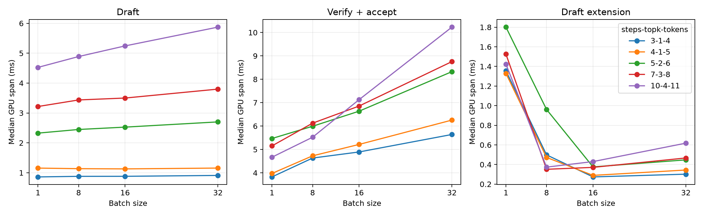
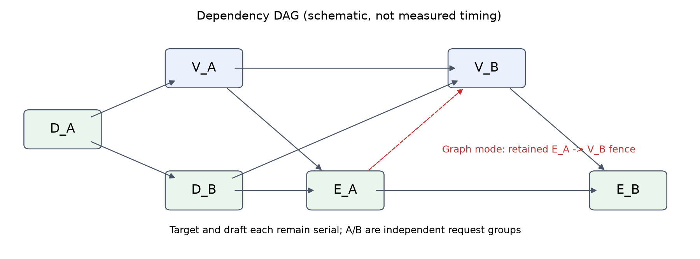
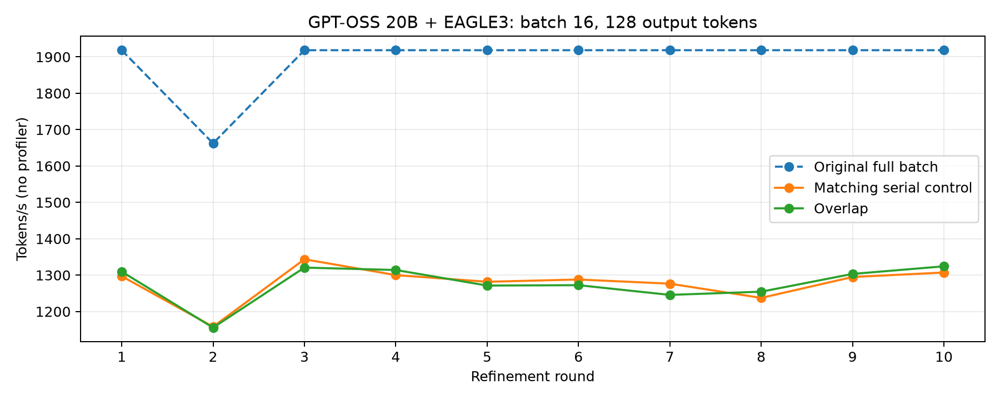
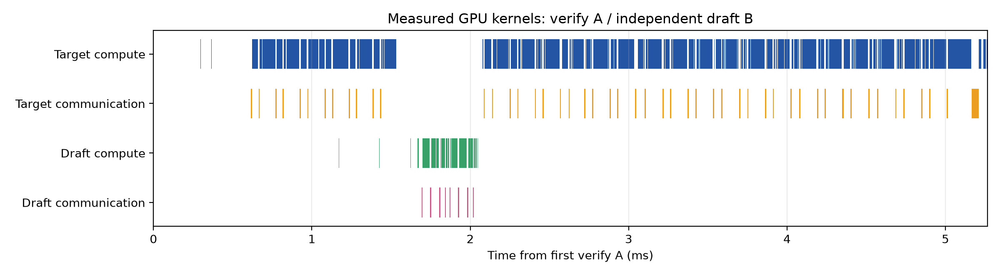
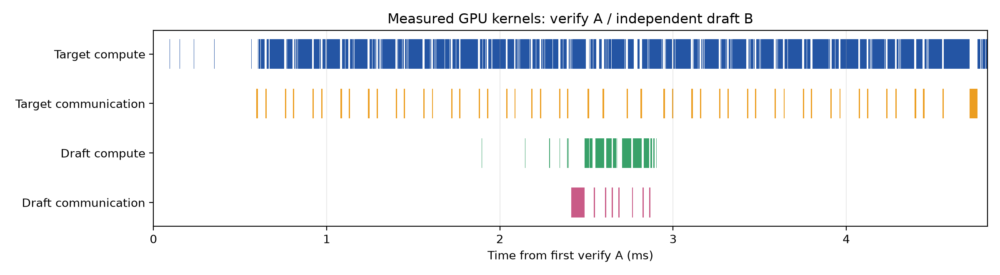

# GPT-OSS speculative overlap：复核与十轮改进

- Target：`openai/gpt-oss-20b`；draft：`zhuyksir/EAGLE3-gpt-oss-20b-bf16`。
- 2×H200，TP2 / EP1，FA3，greedy，完整 decode CUDA Graph；上下文 2048。
- 结论：第十轮 1324.2 tok/s，较第 1 轮 overlap +1.1%，较匹配 serial +1.3%，但较完整 batch **−31.0%**。默认保持 `off`。
- 三次计时、固定顺序且后几轮择优；小幅差异不构成显著加速证据。

## 原始 pipeline：20 组 torch profiling

阶段为 GPU annotation 起止时间，包含等待/launch gap；不是孤立 kernel service time。每组两次请求预热、三次计时，随后独立采集双 rank trace。

| Steps–top-k–tokens | Batch | Draft ms | Verify+accept ms | Extend ms | 平均接受长度 | tok/s |
|---|---:|---:|---:|---:|---:|---:|
| 3-1-4 | 1 | 0.860 | 3.825 | 1.355 | 1.113 | 186.4 |
| 3-1-4 | 8 | 0.880 | 4.632 | 0.498 | 1.097 | 1104.0 |
| 3-1-4 | 16 | 0.881 | 4.891 | 0.274 | 1.083 | 1918.4 |
| 3-1-4 | 32 | 0.910 | 5.639 | 0.302 | 1.077 | 3322.2 |
| 4-1-5 | 1 | 1.155 | 3.973 | 1.329 | 1.113 | 178.8 |
| 4-1-5 | 8 | 1.136 | 4.727 | 0.472 | 1.097 | 1059.4 |
| 4-1-5 | 16 | 1.129 | 5.213 | 0.289 | 1.087 | 1847.4 |
| 4-1-5 | 32 | 1.156 | 6.255 | 0.344 | 1.078 | 3135.8 |
| 5-2-6 | 1 | 2.326 | 5.468 | 1.801 | 1.185 | 155.8 |
| 5-2-6 | 8 | 2.448 | 5.991 | 0.961 | 1.170 | 935.0 |
| 5-2-6 | 16 | 2.526 | 6.635 | 0.376 | 1.175 | 1662.4 |
| 5-2-6 | 32 | 2.701 | 8.325 | 0.447 | 1.185 | 2698.5 |
| 7-3-8 | 1 | 3.216 | 5.151 | 1.526 | 1.255 | 151.8 |
| 7-3-8 | 8 | 3.436 | 6.123 | 0.351 | 1.240 | 899.8 |
| 7-3-8 | 16 | 3.500 | 6.854 | 0.371 | 1.243 | 1602.4 |
| 7-3-8 | 32 | 3.799 | 8.755 | 0.467 | 1.253 | 2598.7 |
| 10-4-11 | 1 | 4.525 | 4.668 | 1.423 | 1.280 | 135.9 |
| 10-4-11 | 8 | 4.889 | 5.522 | 0.373 | 1.275 | 800.0 |
| 10-4-11 | 16 | 5.244 | 7.126 | 0.430 | 1.268 | 1315.3 |
| 10-4-11 | 32 | 5.873 | 10.230 | 0.618 | 1.286 | 2064.5 |



- 高预算配置增加 drafting 和 verification 时间，接受长度提升有限；三个参数同时变化，不能单独归因于 top-k。
- 这里是短提示词 decode probe，接受长度约 1.05–1.29；不代表其他任务或聊天模板负载。

## 数学与实际依赖



令 `g_X` 表示分支准备/launch gap，`F_X` 表示阶段完成时间：

```text
F_DA = DA
F_VA = F_DA + g_VA + VA
F_DB = F_DA + g_DB + DB
s = max(F_DB, F_VA)
F_EA = s + g_EA + EA
F_VB = s + g_VB + VB                         (eager)
F_VB = max(s, F_EA) + g_VB + VB              (graph fence)
F_EB = max(F_EA, F_VB) + g_EB + EB
T = F_EB + H_residual
```

- `H_residual` 只计未被递推覆盖的前后串行工作；不能重复计入分支 gap。
- `δ=g_DB−g_VA` 可为负；CPU release callback 不构成 GPU barrier，节点比例不等于 GPU 时间比例。
- 等分、独立资源、其余 gap=0 且 δ≥0 时，理想 graph 模型才是 `D+max(V,δ+D)+E+V+E+H`。
- `Q≈Bτ/T`：τ 含 bonus；请求吞吐另受 prefill 与尾部影响。

## 十轮改进

Batch16，128 output tokens。C/R/A% = target graph chunks / release index / A 比例；R=−1 为 target enqueue 前放行。

| 轮 | Config | C/R/A% | Serial tok/s | Overlap tok/s | 相对 serial | 相对完整 batch |
|---:|---|---|---:|---:|---:|---:|
| 1 | 3-1-4 | 8/1/50 | 1296.9 | 1309.6 | +0.98% | -31.7% |
| 2 | 5-2-6 | 8/1/50 | 1158.1 | 1155.7 | -0.21% | -30.5% |
| 3 | 3-1-4 | 4/0/50 | 1343.6 | 1320.7 | -1.70% | -31.2% |
| 4 | 3-1-4 | 2/0/50 | 1300.1 | 1314.1 | +1.08% | -31.5% |
| 5 | 3-1-4 | 1/-1/50 | 1281.7 | 1271.4 | -0.81% | -33.7% |
| 6 | 3-1-4 | 2/-1/50 | 1288.0 | 1272.4 | -1.21% | -33.7% |
| 7 | 3-1-4 | 4/0/25 | 1276.5 | 1245.7 | -2.42% | -35.1% |
| 8 | 3-1-4 | 4/0/75 | 1237.4 | 1254.5 | +1.38% | -34.6% |
| 9 | 3-1-4 | 4/3/50 | 1294.8 | 1303.3 | +0.66% | -32.1% |
| 10 | 3-1-4 | 1/0/50 | 1307.2 | 1324.2 | +1.30% | -31.0% |



- 增加可调 cuts/release/split、greedy tree 支持；private tree mask 防止 B proposal 覆盖 A 的验证元数据输入。
- 旧 shared-mask 第二轮仅留作诊断，已重新测量；第 7–10 轮从此前最快 chain schedule 出发调整。
- 第十轮保留完整 target DAG，随后 enqueue 独立 draft graph；没有合并两个模型的 graph/kernel。

## GPU overlap 证据

| 模式 | 循环数 | Draft GEMM∩Target comm ms/cycle | Target GEMM∩Draft comm ms/cycle |
|---|---:|---:|---:|
| R1 off | 6 | 0.0000 | 0.0000 |
| R1 fine_serial | 7 | 0.0000 | 0.0000 |
| R1 fine_overlap | 7 | 0.0034 | 0.0018 |
| R10 fine_overlap | 7 | 0.0227 | 0.0630 |





- 直接求实际 GPU kernel 时间区间交集；不是 CPU span 相交，也不等于节省的关键路径时间。
- EP1 只有 TP AllReduce / AllGather；GPT-OSS DeepEP forward 未实现。本次没有 All2All 证据。
- NCCL residency 含 peer arrival/spinning；第 5/6 轮立即 release 实测两个方向交集均为零。
- 切半损失 target 的批处理收益，是整体慢于原始 pipeline 的主要原因。保留 `E_A→V_B` graph fence。

## 正确性与复现

正确性矩阵及最终验证结果将在完成独立检查后记录；普通性能运行的 shape 数值差异不能作为 token 一致性证据。

```bash
python benchmark/spec_overlap/profile_matrix.py --results benchmark/spec_overlap/results/revision
python benchmark/spec_overlap/run_refinements.py --results benchmark/spec_overlap/results/revision/refinements
python benchmark/spec_overlap/run_correctness.py --results benchmark/spec_overlap/results/revision/correctness-router-fixed
```

- [原始 profiling 飞书报告](https://my.feishu.cn/docx/D1uPdOb4gozVGmxIdLQcyCQgnOb)
- [调度改进飞书报告与证据附件](https://my.feishu.cn/docx/BbutdflyNoq5oAx7p9Ycapi3nZg)
- 紧凑测量数据见 [REVISION_MEASUREMENTS.json](REVISION_MEASUREMENTS.json)；原始双 rank traces、日志、命令、输出 token、source hashes 保存到飞书附件。
